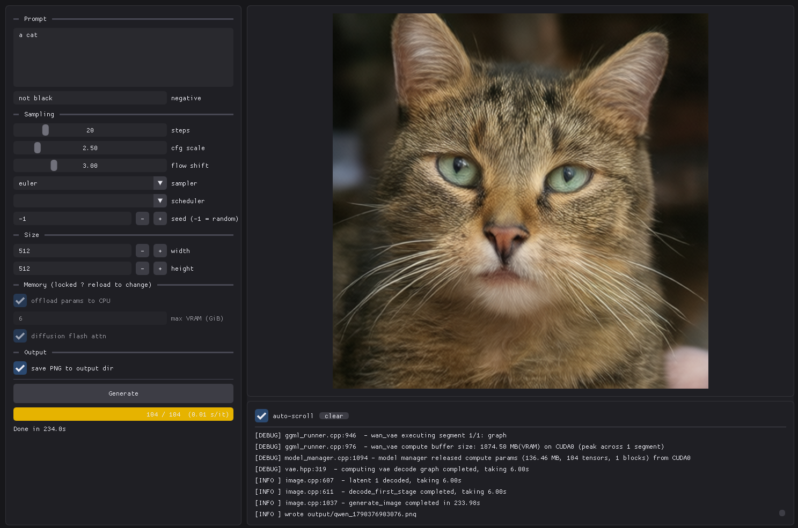

# SD App

Basic GUI to simplify running [stable-diffusion.cpp](https://github.com/leejet/stable-diffusion.cpp) with Qwen Image.



Uses
- [stable-diffusion.cpp](https://github.com/leejet/stable-diffusion.cpp)
- [ImGUI](https://github.com/ocornut/imgui)
- [Qwen Image](https://huggingface.co/Qwen/Qwen-Image-2512)

## Disclaimer

This is a dev WIP that currently only supports [Qwen Image](./scripts/get_qwen_img.sh) for generation, no editing support.

> [!NOTE]
> Parts co-authored with AI.

# Manual Setup

Tested on Windows only

- MSVC 194 using C++20
- vscode
- cmake
- conan

## Thirdparty

[stable-diffusion.cpp](https://github.com/leejet/stable-diffusion.cpp) needs to be compiled from source and setup as a dependency, not using conan2 but submoduled in.

```
git submodule update --init --recursive
```

## Conan

Install [conan](https://conan.io/)

```
pip install conan
```

or using `uv`

```
uv tool install conan
```

To create a default profile for build system run

```
conan profile detect --force
```

## Project

Install project depedencies

```
mkdir build
conan install . --output-folder=build --build=missing
```

Setup cmake

```
cmake -B build -S . -DCMAKE_PROJECT_TOP_LEVEL_INCLUDES=./build/conan_provider.cmake 
```

By default it's configured for CUDA architectures 61 and 86, to override add `-DCMAKE_CUDA_ARCHITECTURES`

# Build

```
cd build
cmake --build .
```

Run test

```
ctest --output-on-failure
```

## Formatting

```
find . -wholename 'app/*.cpp' -o -wholename 'include/*.h' -o -wholename 'src/*.cpp' | xargs clang-format -style=file
```
